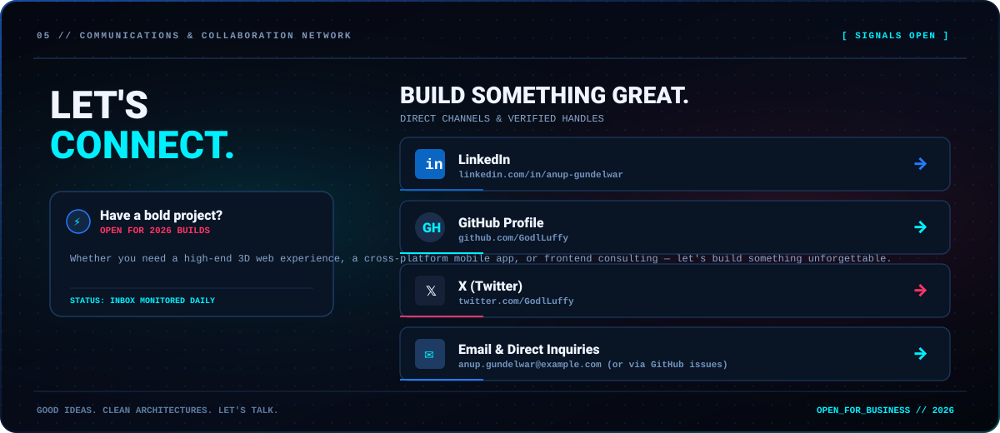

<!-- ================================================================= -->
<!-- GODLLUFFY // HIGH-OCTANE CYBER OBSIDIAN GITHUB PROFILE            -->
<!-- Inspired by Ug0510 (Redline v4 Aesthetic)                        -->
<!-- ================================================================= -->

  

<!-- ==================== PHILOSOPHY & CAPABILITY ==================== -->

  

<!-- ==================== INTERACTIVE TECH STACK ==================== -->

  

<!-- ==================== FEATURED REPOSITORIES TABLE ==================== -->
<h3 align="left">
  
  Things I've Built &amp; Explored
</h3>

| Project | What It Does | Primary Focus | Direct Link |
| :--- | :--- | :--- | :--- |
| [**3D**](https://github.com/GodlLuffy/3D) | Immersive 3D interactive web experiences & WebGL canvas rendering | Three.js + WebGL | [`GodlLuffy/3D`](https://github.com/GodlLuffy/3D) |
| [**NOIR_v2**](https://github.com/GodlLuffy/NOIR_v2) | Sleek cyberpunk dark-mode design system & ultra-minimalist portfolio | UI/UX + Modern CSS | [`GodlLuffy/NOIR_v2`](https://github.com/GodlLuffy/NOIR_v2) |
| [**ShopKeeper**](https://github.com/GodlLuffy/ShopKeeper) | Complete cross-platform mobile retail & inventory management app | Flutter + Dart | [`GodlLuffy/ShopKeeper`](https://github.com/GodlLuffy/ShopKeeper) |
| [**UI-Animation**](https://github.com/GodlLuffy/UI-Animation) | 60FPS fluid interface micro-interactions, spring physics & component lab | CSS3 + JavaScript | [`GodlLuffy/UI-Animation`](https://github.com/GodlLuffy/UI-Animation) |
| [**ishuu-baby-**](https://github.com/GodlLuffy/ishuu-baby-) | Production web application deployed and optimized on Vercel | Full-Stack Web | [Live App ↗](https://ishuu-baby.vercel.app) |
| [**Goblin**](https://github.com/GodlLuffy/Goblin) | Experimental high-aesthetic layout experiments & dark-mode styling | Modular CSS3 | [`GodlLuffy/Goblin`](https://github.com/GodlLuffy/Goblin) |

 

<!-- ==================== REAL WORK / IDENTITY & STATS ==================== -->

  

<!-- DYNAMIC REAL-TIME GITHUB METRICS GRID -->

  
  
  

 

<!-- ==================== CONNECT & COLLABORATE ==================== -->

  

  
  &nbsp;
  
  &nbsp;
  
  &nbsp;
  

  <a href="https://www.linkedin.com/in/anup-gundelwar/">LinkedIn</a> &nbsp;·&nbsp;
  <a href="https://github.com/GodlLuffy">GitHub Profile</a> &nbsp;·&nbsp;
  <a href="https://twitter.com/GodlLuffy">Twitter / X</a> &nbsp;·&nbsp;
  <a href="mailto:gundelwaranup@gmail.com">Direct Inquiry</a> &nbsp;·&nbsp;
  <a href="https://ishuu-baby.vercel.app">Live Showcase</a>

  Curious by default. Building with intent. // Crafted by <strong><a href="https://github.com/GodlLuffy">@GodlLuffy</a></strong>

